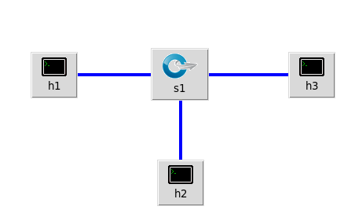

# implement a flow based L2 switch using mininet and OVS



The goal of this network is to make a biodirectional flow between       h1 and h2.
Flows are based upon MAC addresses.  Any trafic from/to h3 will be ignored.
## run: 
```bash
sudo python l2_switch.py
```
## test connections:
```bash
mininet> pingall
*** Ping: testing ping reachability
h1 -> h2 X 
h2 -> h1 X 
h3 -> X X 
*** Results: 66% dropped (2/6 received)
mininet> 
```
